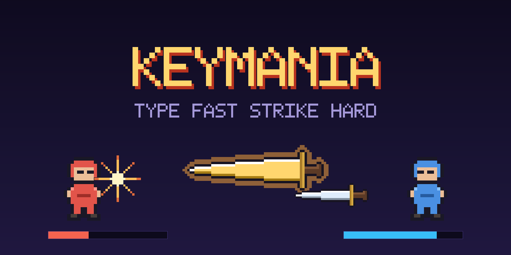

# KeyMania

A real-time typing duel. Every word you finish forges a blade and hurls it at
your opponent; chain words quickly to forge something bigger, and a single typo
shatters your streak.

Type fast, strike hard.


This is the game client. The serverless backend (AWS Lambda + API Gateway
WebSocket) lives in [`keymania`](https://github.com/Daniel-Alamezie/keymania).

> **[docs/ANALYTICS.md](docs/ANALYTICS.md) — PostHog setup and what is
> tracked.** Inert until a key is configured; the doc covers getting one and
> the three questions worth asking on launch day.
>
> **[docs/INTERESTING-PROBLEMS.md](docs/INTERESTING-PROBLEMS.md) — what went
> wrong on the way, and what it taught us.** The bugs whose cause was somewhere
> surprising, or where every tool said the code was fine.
>
> **[docs/GAME.md](docs/GAME.md) — how the game works.** Every rule, constant
> and design decision across both repos, in one place. This README covers what
> KeyMania is and how to run it; that covers what actually happens.

## The core loop

Type each word, then press <kbd>SPACE</kbd> to commit it — that is the moment a
blade is forged and thrown.

| Moment | What happens |
|--------|--------------|
| Keystroke | the character snaps green and pops, with a click that rises in pitch as your combo grows |
| <kbd>SPACE</kbd> | the word is scored, a blade is forged and hurled |
| Blade lands | screen shake scaled to the damage, pixel debris, health chunks down |
| Combo up | the blade visibly upgrades, with a rising fanfare |
| Typo | red shake, buzz, combo shatters back to zero |

Speed matters twice over — but deliberately unevenly. Typing faster throws
*more* blades per second, which is the main reward; the per-word speed
multiplier is a modest bonus on top. Rewarding speed steeply in both rate and
damage compounds quadratically and turns duels into blowouts.

Space is a real key rather than something the game skips for you. It gives every
word a deliberate trigger, and keeps the typing honest.

## Sound

All effects are synthesised at runtime with the Web Audio API — oscillators and
filtered noise, no audio files. Toggle with the speaker icon.

## Layout

A hybrid of a split-screen race and a side-view brawl:

```
 opponent HUD ....... health + their progress through the sentence
 arena .............. both fighters, blades flying between them
 your deck .......... the sentence you are typing, combo meter, your health
```

## Project structure

```
app/          Next.js routes and global styling
components/   presentational UI (fighters, health, sentence, combo, overlays)
game/         pure rules — no React, no timers, fully unit tested
  engine.ts     scoring: wpm -> multipliers -> damage -> blade tier
  duelReducer   the duel state machine
  bot.ts        the simulated opponent
render/       canvas overlay for blades, trails and particles
tools/        pixel-art sprite generator (Python)
```

`game/engine.ts` is deliberately pure so the identical rules can later run in
the server-side referee — the server must be the authority on damage rather
than trusting a client.

## Multiplayer

Duel a human over a WebSocket to the [`keymania`](https://github.com/Daniel-Alamezie/keymania)
backend. Host a **public** room (listed in the lobby for anyone to join) or a
**private** one (join by sharing a 5-character code).

The server is the referee. Your client only ever claims *"I finished this word
in this long"* — it never says how much damage it dealt. The server checks the
word really is the one you owed from the shared script, clamps implausible
timings and owns both health totals. Locally your blade launches immediately as
a prediction, then health reconciles to whatever the server says.

Copy `.env.example` to `.env.local` and point `NEXT_PUBLIC_WS_URL` at a
deployment. Without it the game still plays single-player against the bot.

## Running it

```bash
npm install
cp .env.example .env.local   # optional: enables multiplayer
npm run dev                  # http://localhost:3000
```

```bash
npm test           # engine unit tests
npm run typecheck
npm run build
npm run sprites    # regenerate pixel art into public/sprites (needs Python + Pillow)
```

## Art

Every sprite in this repo is original and generated by script — nothing is
sourced from elsewhere. Blades are procedural so the five power tiers scale
consistently; fighters are hand-authored pixel maps. The banner is composed
from those same sprites with a hand-authored 5x7 pixel font.

```bash
npm run sprites    # public/sprites/*.png
npm run banner     # docs/banner.png
```

Both need Python with [Pillow](https://pillow.readthedocs.io/).

## Status

Playable single-player against a bot at three difficulties. Multiplayer over
the WebSocket API is the next step.

## Contributing

Issues and pull requests are welcome. Good first contributions: sound effects,
new sentence packs, extra blade tiers, or accessibility improvements.

Please keep `game/` pure — no React or timers in there, so the rules stay
testable and can be reused by the server-side referee.

## License

[MIT](./LICENSE) © Daniel Alamezie

Fonts are loaded via `next/font` from Google Fonts: Press Start 2P and
JetBrains Mono, both under the SIL Open Font License.
